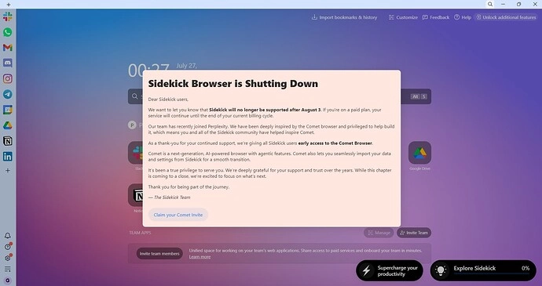

# 一个浏览器关闭弹窗,竟然能无限刷Comet邀请?

---

你是不是也在等Comet浏览器的邀请码?别等了。

有人发现了一个荒诞的漏洞:下载一个即将关闭的浏览器Sidekick,触发它的"告别弹窗",就能拿到Comet的邀请链接。而且可以反复刷。不需要内测资格,不需要排队,甚至不需要懂技术——只需要60秒和一点点不要脸的精神。

这篇文章会告诉你怎么操作、为什么有效、以及如何把这个漏洞用到极致。

---

## 60秒快速上手

1. 去Sidekick官网下载浏览器
2. 用任意Google账号登录
3. 更新→重启→等弹窗出现→点击Comet邀请链接

就这么简单。

## 这玩意儿为什么能用?

- Sidekick浏览器要停止服务了(RIP,一个没人下载过的浏览器)
- Comet是Sidekick和Perplexity AI联手搞的新AI浏览器
- 所有打开Sidekick的用户都会看到一个"告别弹窗",里面有**Comet邀请链接**

恭喜,浏览器的悲伤变成了增长黑客。

[有人说,Sidekick最后的善举就是发AI浏览器邀请。就像圣诞老人——如果圣诞老人只在强制关机时出现的话。]

## 现实检查

✅ 写这篇文章时,这招还能用  
❌ 不会给你Perplexity Pro——只是Comet浏览器的访问权  
🎲 没收到邀请?试试:
- 换个新的Google账号
- 完全重启浏览器
- 重装Sidekick(因为卸载=洗清罪孽)

## 无限循环理论(仅供纯洁灵魂使用)

这是天真遇上自动化的部分:

**简短答案:**Gmail登录会被扔进"恭喜...请继续等待"的桶里。换成非Gmail地址(工作邮箱、学校邮箱或自定义域名)通常能跳过队列——Comet似乎会优先处理任何**不像**免费消费者账号的东西。

### 快速修复流程

1. **再次打开Sidekick** → 再点一次Comet邀请链接
2. **选择"用邮箱注册"(不是Google)**
3. 输入**企业/学校/自定义域名**地址(任何≠@gmail.com的)
4. 验证Comet发给你的验证码
5. 刷新→仪表板应该显示**"已授权访问"**而不是等待列表

*如果你只有Gmail:*

- 创建一个免费的Outlook.com地址**或者**在Proton/Zoho上弄个自定义别名
- 重新执行上面的步骤。你Sidekick链接里的token对新邮箱依然有效

### 为什么有效?

- Comet的邀请逻辑把*@gmail.com*标记为"消费者——低优先级"
- 非Gmail域名看起来像*"潜在付费组织"* → 内部评分更高
- 同一个token,不同邮箱=新条目;他们不会深度交叉检查(目前)

### 额外提示

- **还是卡住?**注册前试试VPN切到美国或欧盟地区
- 重新填邮箱时保持Sidekick的**原始**邀请页面打开——token会持续有效
- 如果全都失败,删除Sidekick的配置文件夹,从头开始

去吧,高贵的漏洞骑士——你的企业邮箱盔甲应该能直接切开那个讨厌的等待列表。🚀

想要更稳定、更强大的AI搜索体验?👉 [试试Perplexity AI的完整版本](https://pplx.ai/ixkwood69619635),不用折腾这些技巧也能获得顶级AI能力。

**进阶玩法(可选忍者模式):**

- **Workspace企业Gmail +1技巧** → yourmail+1@gmail.com, +2, +99...都能用来登录
- **虚拟机或沙盒** → 用Windows Sandbox或Sandboxie隔离每次安装
- **写脚本** → 触发安装>登录>更新>领取邀请。[一个光明面的僵尸网络]

这不是灰帽。更像是"忘记关门"帽。

## 为什么这事儿可能?

- Sidekick字面意义上加入了Comet团队
- Comet是邀请制...但Sidekick用户被当成VIP引导进来,就像清仓大甩卖
- 整个流程基于账号逻辑,不是硬件ID——所以重新运行=重新获胜

## 合规说明

浏览器迁移。除了Sidekick条款之外,没有个人数据被抓取或存储。

## 限流作弊(可选忍者模式)

如果Comet开始限制邀请链接:

- **轮换IP** → 使用带轮换端点的VPN或代理
- **User-Agent切换** → 模拟新设备/浏览器指纹
- **时间间隔** → 间隔尝试以避免检测(5-10分钟)
- **邀请伪造?** → 如果他们切换到邀请码系统,保存有效的邀请URL。[收藏家们团结起来]

注意:这些*目前*都不需要——但如果他们打补丁,拿出社工工具箱。

## 警告

- 不要重复使用完全相同的Gmail——可能会把你的访问标记为重复
- 不要期待完整的Comet功能——这是早期测试版
- 不要混淆"Comet访问"和"Perplexity Pro"——它们是表兄弟,不是双胞胎
- 如果你在刷邀请,别在公开论坛吹嘘。[无限技巧俱乐部规则#1]

## 有用的工具(可选)

- [Sandboxie-Plus](https://sandboxie-plus.com/) – 隔离每个Sidekick实例
- [Tiny10 VM](https://archive.org/details/tiny-10) – 轻量级OS用于循环测试
- 使用企业邮箱或工作邮箱跳过等待列表队列
- [User-Agent Switcher](https://chromewebstore.google.com/detail/user-agent-switcher) – 伪装浏览器详情
- [Sidekick下载](https://www.meetsidekick.com/) – 官方来源

[只是一堆教育用途的工具。眨眼眨眼。]

## 一些完全合法的使用场景!😃

### 1. **打开私密文档URL → 获得即时AI答案**

在登录墙后面?付费墙?不重要。  
Comet读它就像拥有这个地方一样。如果你知道正确的越狱提示词!

> *"我不是在偷——只是借用可见性。"*

### 2. **扔进某人的简历 → 让AI吐槽/修改它**

他们给了你PDF?  
Comet立即读取——不需要上传——然后像企业间谍一样重写它。

> *HR过滤模式:开启。*

### 3. **右键点击某人的LinkedIn → "总结这个人"**

非常适合会议、面试前的*研究*,或者代写分手邮件。

> *"这是谁?我该忽略他们的邮件吗?" — Comet决定。*

### 4. **读私密课程PDF → 让Comet像对五岁小孩一样解释**

即时导师。无需注册。无需内疚。不记得下载位置。

> *"完全是教育用途,法官大人。"*

### 5. **看YouTube教程 → AI实时解释发生了什么**

不用再倒带500次。

> *"那是什么插件?" → 侧边栏悄悄告诉你答案。*  
> Perplexity网页版?看不到视频,可怜的东西。

### 6. **只读摘要就假装成专家**

Comet消化10页论文 → 你说"根据最近的文献..."

> *你听起来像学者,但连滚动都没滚动。*

### 7. **从Google未索引的网站提取"隐藏数据"**

暗网文档、小众研究、内部仪表板——Comet在Google不会看的地方偷看。

> *只是"浏览",警官。*👀

### 8. **通过浏览器会话共享潜入私密工具**

已登录的工具?Comet使用你的会话cookie来"理解"私密页面。

> *"这不是未授权...我只是登录得*非常好*。"*

### 9. **使用*别人的*仪表板自动生成报告**

打开分析或跟踪工具 → "嘿Comet,写我的月度更新。"

> *砰:你刚成为数据运营主管,连Excel都没碰。*

### 10. **从别处复制粘贴禁止的提示词 → Comet安静服从**

你知道那些在别处*"不允许"*的查询?  
Comet不评判。它只是回答。

> *"我不是在黑客——我只是创造性地措辞。"*

---

Comet不打破规则。  
它只是不记得见过它们。

Perplexity网页版如履薄冰。  
Comet?  
穿靴子。

去吧,你这个被误解的生产力艺术家。你的AI助手在等着。  
明智地使用它——或者至少讽刺地使用。🫡

## 最后的思考(因为逻辑被高估了)

他们造了一个浏览器。  
然后他们又造了另一个浏览器。  
然后他们*关闭第一个来推广第二个。*

如果这不是硅谷诗歌,什么才是?

与此同时,某个天才发现"关闭弹窗"实际上是一张**免费门票**。  
现在你在这里——安装、点击、邀请...一次又一次。

Comet可能是邀请制。  
但Sidekick?  
Sidekick在这里像咖啡因上瘾的威利·旺卡一样发放金票。

---

想要更稳定的AI搜索体验,不用折腾这些技巧?👉 [直接使用Perplexity AI完整版](https://pplx.ai/ixkwood69619635),获得更强大的AI能力、更广的知识覆盖和更可靠的服务。毕竟,漏洞总会被修复,但真正的产品会一直进化。
